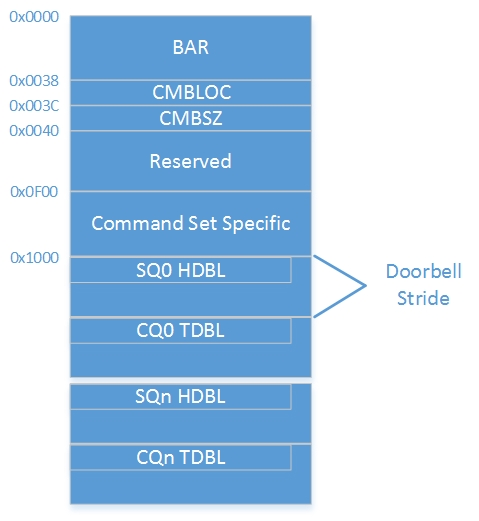

#NVM Express 协议

#文档说明

本文可以看做是对[NVME1.2版协议][1]的研读笔记，部分段落是协议原文的直接翻译。一些数据格式则是直接以C语言结构体的形式呈现。

#1 NVM Express协议是什么？
NVM(Non-Volatile Memory)即非易失存储器。NVM Express是一套主机与存储设备之间的访问接口（寄存器级的接口）。典型应用如挂在PCIE总线下的SSD设备。

NVM Express协议描述了如何通过寄存器接口访问NVM子系统，并定义了一组访问NVM子系统的标准命令集。

##1.1 

##1.2 (字母，词组，缩写等)定义

	- Admin Queue ： 管理队列。指ID为0的提交队列(Submision Queue)和完成队列(Completion Queue)。或称为Amdin Submision Queue和Amdin Completion Queue。主机通过此队列发送Admin命令和接收命令状态。

	- arbitration burst : 提交队列一次可提交的最大命令个数。

#2 控制器寄存器(Controller Registers)

Controller Registers是一段存储器空间，可以接次序访问或按变量位宽访问（要具有这两特点，有些计算机架构需定义此空间为非缓存的空间）。主机须用本机位宽或32BIT对齐访问，否则会引发不确定的行为。不支持一次访问两个或多个寄存器。未定义的寄存器或寄存器中未定义的位读为0。

##2.1 寄存器定义

~~~{.c}
	struct nvme_bar {
		__u64			cap;	/* Controller Capabilities */
		__u32			vs;		/* Version */
		__u32			intms;	/* Interrupt Mask Set */
		__u32			intmc;	/* Interrupt Mask Clear */
		__u32			cc;		/* Controller Configuration */
		__u32			rsvd1;	/* Reserved */
		__u32			csts;	/* Controller Status */
		__u32			rsvd2;	/* Reserved */
		__u32			aqa;	/* Admin Queue Attributes */
		__u64			asq;	/* Admin SQ Base Address */
		__u64			acq;	/* Admin CQ Base Address */
	};
~~~

###2.1.1 CAP(Contoller Capbilities)
CAP寄存器定义了控制器基本的功能。如：

	- MPSMAX : 所支持最大的Host Memory Page Size.(4K的倍数)
	- MPSMIN : 所支持最小的Host Memory Page Size.(4K的倍数)
	- CSS    : 所支持的命令集（目前只支持NVM Command Set）。
	- NSSRS  : 标志位。为1则支持NVM子系统复位。
	- DSTRD  : Doorbell Stride. Doorbell寄存器之间对齐位宽（4字节的倍数）。
	- TO     : 主机等待csts.rdy位跳变的最长时间。
	- AMS    : 仲裁机制。（Round Robin and Vendor Specific）
	- CQR    : 标志位。为1则表示IO SQ/CQ队列存储空间在物理上要连续。
	- MQES   : 队列最大长度。（0'based value；指Entries个数）

###2.1.2 VS (Version)
支持的协议版本。目前有效的有：1.0，1.1，1.2。对应的值分别为：

	- 0x00010000
	- 0x00010100
	- 0x00010200

###2.1.3 INTMS (Interrupt Mask Set)
中断屏蔽使能寄存器。

###2.1.4 INTCS (Interrupt Mask Clear)
中断屏蔽清除寄存器。

INTMS和INTCS在下列中断模式下用作中断屏蔽使能和清除（bit significant）。

	- pin-base interrupt
	- single message MSI
	- multiple message MSI

在MSI-X中断模式下时则使用interrupt mask table.此时主机不应访问INTMS和INTCS寄存器。

###2.1.5 CC (Controller Configuration)
控制器配置寄存器。可用的配置项有：

	- IOCQES	 : IO CQ Entry Size.(作用值为2^IOCQES) 
	- IOSQES	 : IO SQ Entry Size.(作用值为2^IOSQES) 
	- SHN    : 关闭消息通知类型。
	- AMS    : 使用中的仲裁机制。
	- MPS    : Memory Page Size。（4K的倍数，最小4K最大128M）
	- CSS    : 使用中的IO命令集。目前只支持NVM Command Set。
	- EN     : 写1使能控制器。

AMS，MPS，CSS域应在使能EN位之前配置。

###2.1.6 CSTS (Controller Status)
控制器状态寄存器。状态位有：

	- PP     : 标志位。为1时表示控制器暂停命令处理转而处理其它事件。
	- NSSRO  : 标示位。为1时表示有NVM子系统复位事件。
	- SHST   : 关闭状态。（00b=未关闭，01b=关闭处理中 10b=关闭处理完成）
	- CFS    : 标志位。为1时表示有致命错误发生。
	- RDY    : 标志位。为1时表示准备好接收并处理命令。

CC.EN清零时CSTS.RDY也应清零。

